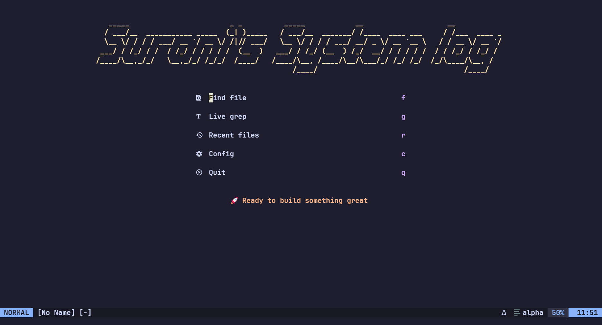
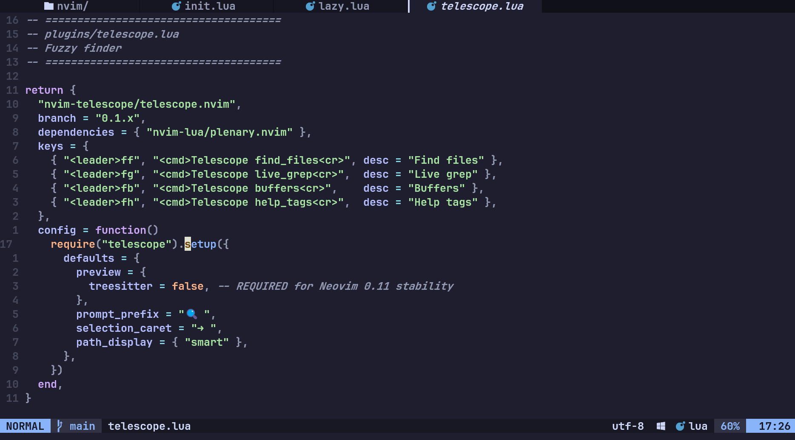
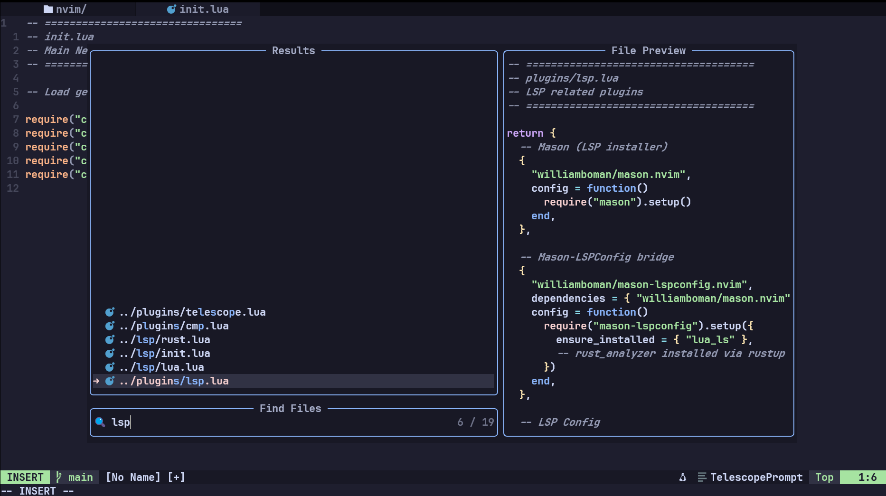
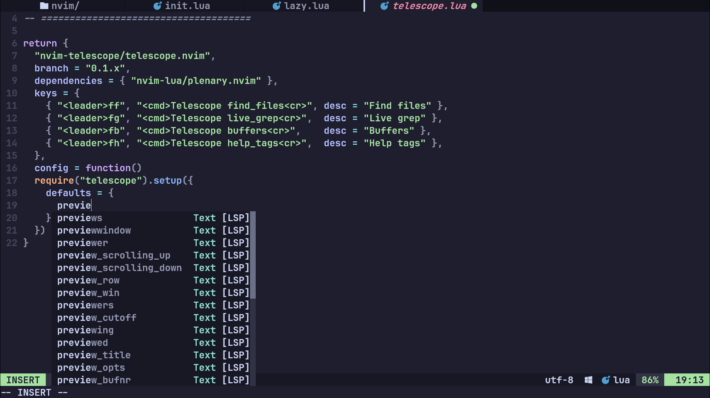

# Neovim Configuration

A clean, modular Neovim configuration for Neovim 0.11+.

## Screenshots

### Dashboard


### Editor


### Telescope


### LSP & Completion


## Requirements

- Neovim >= 0.11
- Git
- [Nerd Font](https://www.nerdfonts.com/) (for icons)
- ripgrep (for Telescope live grep)
- Node.js (for some LSP servers)

### For Rust Development
- Rust toolchain via [rustup](https://rustup.rs/)
- rust-analyzer: `rustup component add rust-analyzer`

## Installation

```bash
# Backup existing config
mv ~/.config/nvim ~/.config/nvim.bak

# Clone this config
git clone <your-repo-url> ~/.config/nvim

# Start Neovim (plugins will auto-install)
nvim
```

## Structure

```
~/.config/nvim/
├── init.lua              # Entry point
├── ascii-art.txt         # Dashboard header (editable)
├── lua/
│   ├── config/
│   │   ├── lazy.lua      # Plugin manager bootstrap
│   │   ├── options.lua   # Editor settings
│   │   ├── keymaps.lua   # Key mappings
│   │   ├── cmp.lua       # Completion config
│   │   └── lsp/
│   │       ├── init.lua  # LSP entry point
│   │       ├── lua.lua   # Lua LSP config
│   │       └── rust.lua  # Rust LSP config
│   └── plugins/
│       ├── init.lua      # Plugin aggregator
│       ├── theme.lua     # Catppuccin colorscheme
│       ├── telescope.lua # Fuzzy finder
│       ├── lsp.lua       # LSP plugins
│       ├── cmp.lua       # Completion plugins
│       ├── treesitter.lua# Syntax highlighting
│       └── ui.lua        # UI components
```

## Plugins

| Plugin | Description |
|--------|-------------|
| [lazy.nvim](https://github.com/folke/lazy.nvim) | Plugin manager |
| [catppuccin](https://github.com/catppuccin/nvim) | Colorscheme |
| [telescope.nvim](https://github.com/nvim-telescope/telescope.nvim) | Fuzzy finder |
| [nvim-treesitter](https://github.com/nvim-treesitter/nvim-treesitter) | Syntax highlighting |
| [nvim-lspconfig](https://github.com/neovim/nvim-lspconfig) | LSP configuration |
| [mason.nvim](https://github.com/williamboman/mason.nvim) | LSP installer |
| [nvim-cmp](https://github.com/hrsh7th/nvim-cmp) | Autocompletion |
| [lualine.nvim](https://github.com/nvim-lualine/lualine.nvim) | Statusline |
| [bufferline.nvim](https://github.com/akinsho/bufferline.nvim) | Buffer tabs |
| [alpha-nvim](https://github.com/goolord/alpha-nvim) | Dashboard |

## Keybindings

### General
| Key | Action |
|-----|--------|
| `<Space>` | Leader key |

### Telescope
| Key | Action |
|-----|--------|
| `<leader>ff` | Find files |
| `<leader>fg` | Live grep |
| `<leader>fb` | Buffers |
| `<leader>fh` | Help tags |

### LSP
| Key | Action |
|-----|--------|
| `gd` | Go to definition |
| `K` | Hover documentation |
| `<leader>rn` | Rename |
| `<leader>ca` | Code action |
| `[d` | Previous diagnostic |
| `]d` | Next diagnostic |

### Completion
| Key | Action |
|-----|--------|
| `<Tab>` | Next suggestion |
| `<S-Tab>` | Previous suggestion |
| `<CR>` | Confirm selection |
| `<C-Space>` | Trigger completion |

## Customization

### Change Dashboard Art
Edit `~/.config/nvim/ascii-art.txt` with your ASCII art.

### Add New Plugins
Create a new file in `lua/plugins/` (e.g., `lua/plugins/myplugin.lua`):

```lua
return {
  "author/plugin-name",
  config = function()
    -- your config here
  end,
}
```

### Add New LSP Server
Create a new file in `lua/config/lsp/` (e.g., `lua/config/lsp/python.lua`):

```lua
vim.lsp.config("pyright", {
  -- config here
})
vim.lsp.enable("pyright")
```

Then add `require("config.lsp.python")` to `lua/config/lsp/init.lua`.

## Commands

| Command | Description |
|---------|-------------|
| `:Lazy` | Open plugin manager |
| `:Lazy sync` | Update plugins |
| `:Mason` | Open LSP installer |
| `:LspInfo` | Check LSP status |
| `:TSUpdate` | Update Treesitter parsers |

## License

MIT
